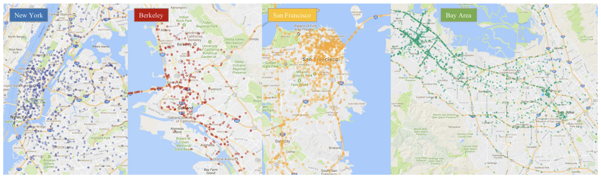
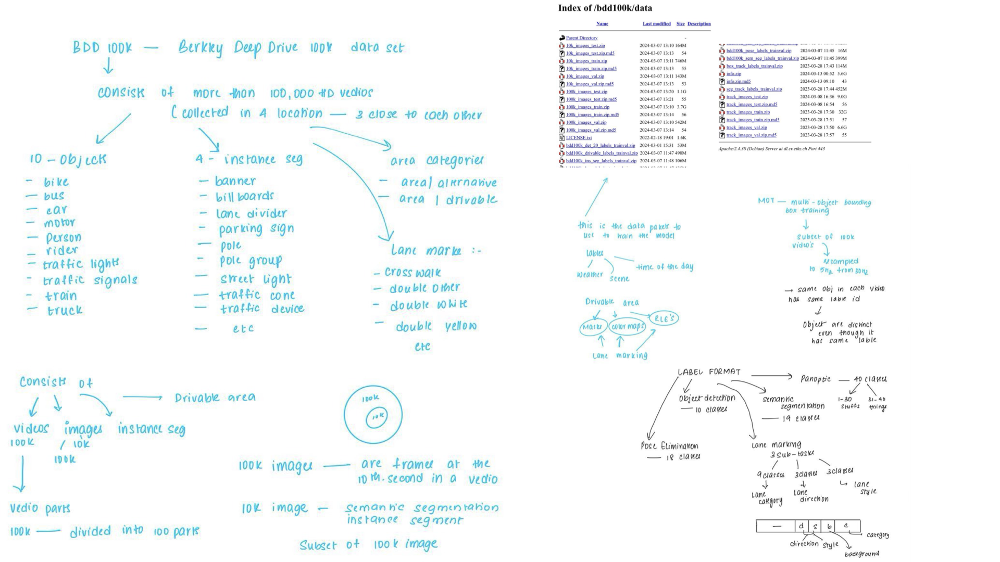
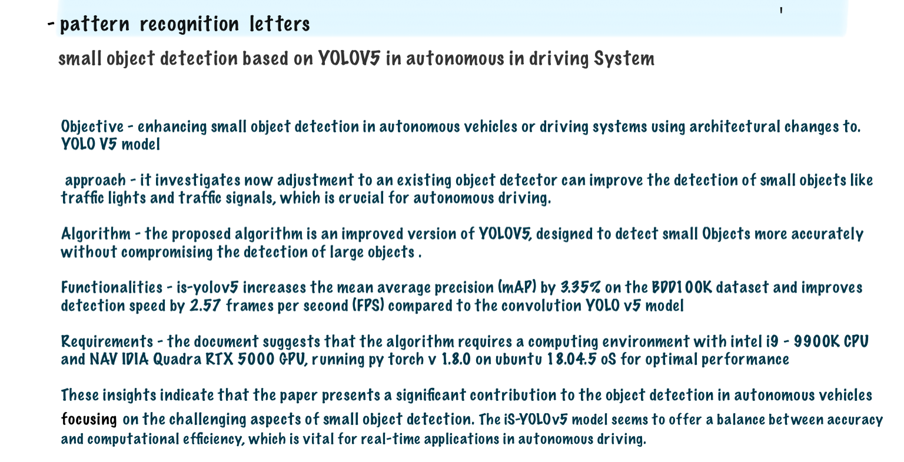

# Object Detection For Autonomous Vehicles

Detecting small objects like traffic signs and lights is more difficult due to their complex design. Also, issues like uneven backgrounds and visual distortion from poor weather and lighting conditions make it difficult to identify small objects accurately. The project aims to develop an efficient algorithm for object detection in autonomous vehicles using the YOLO and CARLA.

## Presentation 
- [PPT](https://docs.google.com/presentation/d/1Lr0VBpTcvm5rvAFBqD53Gc952fLJjmiugZ4jqEfVi_U/edit?usp=sharing)
- [PPT2](https://github.com/Abhijit7979/Object-Detection-For-Autonomous-Vehicles/blob/main/ppt2.pdf)
## Architectures
- Yolo V5
- R-CNN 
- SSD-1 
## Data Sets
- [BDD 100k](http://bdd-data.berkeley.edu/) - @varshi @ashritha and Research-1
## Data Set Description
The Berkeley Deep Drive 100k. Data set is a large-scale diverse driving video dataset where it is split into three parts training (70K), validation (10K) and testing (20K) sets.The dataset contains not only images with high resolution (720p) and high frame rate (30fps), but also GPS/IMU recordings to preserve the driving trajectories and the videos were recorded in diverse weather conditions at different times of the day.The whole data set is captured in four  places they are New York, San Francisco ,Bay Area and Berkeley.

## Documentation

- [PPT](https://github.com/Abhijit7979/Object-Detection-For-Autonomous-Vehicles/blob/main/Documents/Description%20PPT.pdf)

## Mentor
- [@Mahesh Chowdary Kongara](https://www.mahindrauniversity.edu.in/faculty/mahesh-chowdary-kongara/)
## Team Members

- [@Abhijit rao](https://github.com/Abhijit7979)
- [@Varshini](https://github.com/varshinivaddepalli)
- [@Gagan neeli](https://github.com/gaganneeli)
- [@Ashritha](https://github.com/sriashritha0403)
- [@Srinivas Gurram](https://github.com/srinivasgurram6000)

## Reference Documents
- [Research Papers](https://github.com/Abhijit7979/Object-Detection-For-Autonomous-Vehicles/tree/main/Research%20papers)
